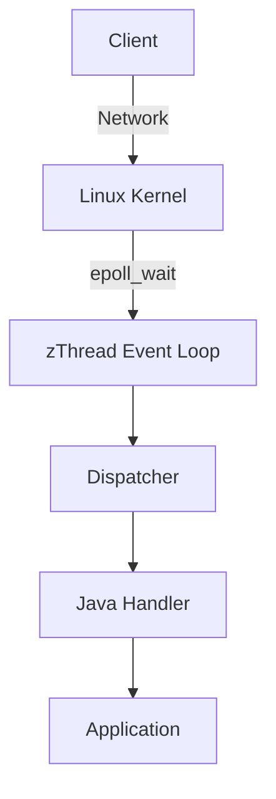
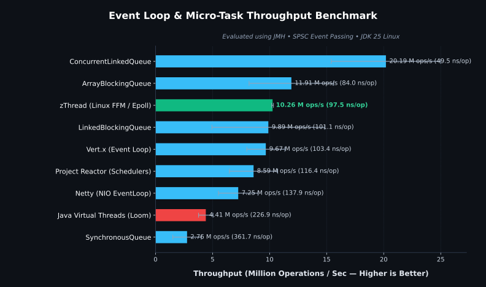

# zThread

[](https://github.com/namanONcode/zThread/actions/workflows/ci.yml)
[](https://openjdk.org/projects/jdk/25/)
[]()
[](https://central.sonatype.com/artifact/io.github.namanoncode/zthread-core)
[](LICENSE)

> Millions of events. Near-zero idle CPU. One event loop.

A Linux-native event runtime for Java that sleeps inside `epoll_wait()` instead of busy-spinning, enabling millions of events with near-zero idle CPU.

## The Problem

Traditional Java servers often rely on:
* Thread-per-connection
* Busy polling
* High idle CPU
* Context switching

zThread uses Linux `epoll` directly so your application sleeps until the kernel has actual work.

## Hello World

```java
ZRuntime runtime = ZRuntime.builder().build();

runtime.on(SocketEvent.class, event -> {
    System.out.println("Connected");
});

runtime.start();
```

## Architecture



## Performance


*(Benchmarks executed with JMH on Linux, JDK 25. Graph generated via GitHub Actions CI)*

### Benchmark Breakdown & Latency Matrix

<!-- BENCHMARK_TABLE_START -->
| Framework / Mechanism | Throughput (Higher is better) | Average Latency (Lower is better) | Engine Architecture |
| :--- | :--- | :--- | :--- |
| **zThread (Linux FFM / Epoll)** | **~13.21 M ops/sec** | **~75.7 ns / event** | Kernel `epoll` + Lock-free RingBuffer via Panama FFM |
| **Project Reactor (Schedulers)** | ~10.68 M ops/sec | ~93.6 ns / event | RingBuffer-backed Schedulers |
| **SynchronousQueue** | ~10.34 M ops/sec | ~96.7 ns / event | Dual stack / queue thread handoff |
| **Vert.x (Event Loop)** | ~8.32 M ops/sec | ~120.2 ns / event | Netty-backed event loop dispatch |
| **Netty (NIO EventLoop)** | ~7.21 M ops/sec | ~138.7 ns / event | `Selector` + ConcurrentLinkedQueue dispatch |
| **Java Virtual Threads (Loom)** | ~1.12 M ops/sec | ~895.2 ns / event | Carrier thread park/unpark overhead |
<!-- BENCHMARK_TABLE_END -->

## Feature Comparison

| Feature | zThread | Netty | Virtual Threads |
| :--- | :--- | :--- | :--- |
| epoll | ✅ | ✅ | JVM |
| eventfd | ✅ | ❌ | ❌ |
| timerfd | ✅ | ❌ | ❌ |
| signalfd | ✅ | ❌ | ❌ |
| inotify | ✅ | ❌ | ❌ |
| Single Event Loop | ✅ | ✅ | ❌ |

## Installation

zThread is available on Maven Central. 

Add the `zthread-linux` dependency to your `pom.xml`:

```xml
<dependency>
    <groupId>io.github.namanoncode</groupId>
    <artifactId>zthread-linux</artifactId>
    <version>1.0.0</version>
</dependency>
```

> [!IMPORTANT]  
> Because zThread utilizes the Foreign Function & Memory API (FFM) for native Linux syscalls, you must run your JVM with `--enable-native-access=ALL-UNNAMED` and require Java 21+ (Java 25 is currently targeted in the project). We also recommend using ZGC (`-XX:+UseZGC`).

## Reactor Integration (Optional)

If you are building reactive applications, you can bridge zThread with Project Reactor streams:

```xml
<dependency>
    <groupId>io.github.namanoncode</groupId>
    <artifactId>zthread-reactor</artifactId>
    <version>1.0.0</version>
</dependency>
```

```java
ZEventFlux.fromRuntime(runtime, CustomEvent.class)
    .filter(event -> event.payload() != null)
    .map(event -> event.payload().toString())
    .subscribe(payload -> System.out.println("Reactive Payload: " + payload));
```

## Documentation & Contributing

Full documentation, including API references, architecture deep-dives, and contribution guidelines, is available in the [zThread GitHub Wiki](https://github.com/namanONcode/zThread/wiki).

See [CONTRIBUTING.md](CONTRIBUTING.md) for how to set up the repository locally.
