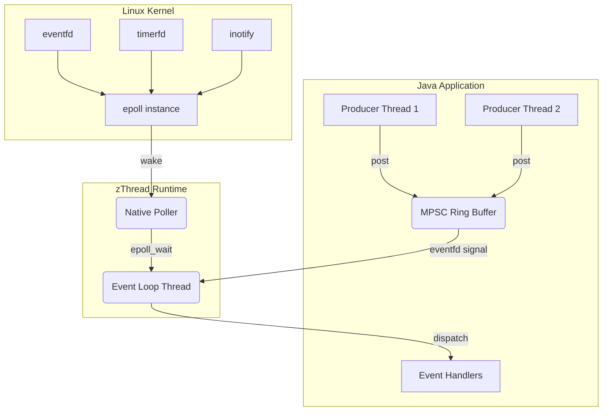

# Architecture

zThread uses a layered architecture to isolate the public Java API from the underlying native Linux mechanisms. The framework relies on the Java Foreign Function & Memory (FFM) API to avoid JNI overhead.

## High-level architecture

The system consists of two primary boundaries:
1. **User Space (Java):** Where the developer registers handlers, posts events, and configures the runtime.
2. **Kernel Space (Linux):** Where the event loop thread sleeps (`epoll_wait`) until an event occurs on a file descriptor.

## Layered architecture

### 1. The Core API (`zthread-core`)
Provides interface definitions that application developers interact with. It contains no OS-specific logic.
* `ZRuntime`: The main interface for starting the loop and posting events.
* `ZRuntimeBuilder`: Fluent builder for configuration.
* `ZRuntimeFactory`: SPI interface used by the builder to discover the native implementation at runtime.

### 2. The Linux Implementation (`zthread-linux`)
Implements the core interfaces using native calls.
* `LinuxRuntime`: The concrete implementation of `ZRuntime`.
* `LinuxEventLoop`: A dedicated thread that continuously polls for events and drains the MPSC ring buffer.
* `LinuxNativePoller`: The FFM bridge that links to `libc.so` (or `libc.so.6`). It handles memory segments for `epoll_event` structs and invokes `epoll_create1`, `epoll_ctl`, and `epoll_wait`.

## Request flow

When a producer thread calls `runtime.post(event)`:

1. **Insertion:** The event is written into a lock-free Multi-Producer Single-Consumer (MPSC) Ring Buffer.
2. **Wakeup Signal:** If the event loop thread is currently parked in the kernel (`epoll_wait`), the producer writes an 8-byte integer to an `eventfd`. 
3. **Kernel Wakeup:** The kernel detects activity on the `eventfd`, wakes the event loop thread, and returns control to `LinuxNativePoller`.
4. **Drain & Dispatch:** The event loop reads the `eventfd` to clear the signal, then drains the entire MPSC ring buffer, passing each event to its registered handler sequentially.

## Component responsibilities

* **MPSC Ring Buffer:** Handles high-throughput, thread-safe queuing of events from multiple producer threads without locking.
* **Native Poller:** Manages native off-heap memory allocation for Linux structures and executes exact syscalls via FFM.
* **Event Dispatcher:** Maintains a map of event types to `Consumer<T>` handlers and executes them when the loop drains the buffer.
