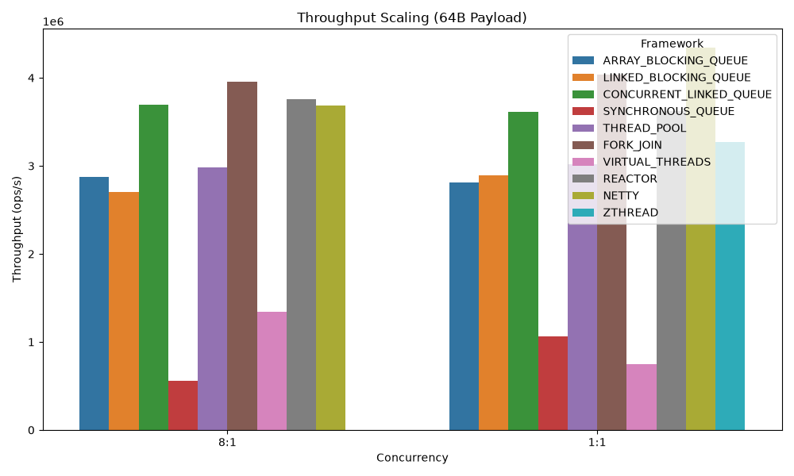

# zThread Benchmark Results

## Scaling Throughput (64B)

## Raw Data
| Framework               | Concurrency   |   PayloadSize |   Throughput (ops/s) |   Error |
|:------------------------|:--------------|--------------:|---------------------:|--------:|
| ARRAY_BLOCKING_QUEUE    | 8:1           |            64 |          2.8751e+06  |     nan |
| LINKED_BLOCKING_QUEUE   | 8:1           |            64 |          2.7059e+06  |     nan |
| CONCURRENT_LINKED_QUEUE | 8:1           |            64 |          3.69265e+06 |     nan |
| SYNCHRONOUS_QUEUE       | 8:1           |            64 |     560335           |     nan |
| THREAD_POOL             | 8:1           |            64 |          2.97949e+06 |     nan |
| FORK_JOIN               | 8:1           |            64 |          3.95786e+06 |     nan |
| VIRTUAL_THREADS         | 8:1           |            64 |          1.33933e+06 |     nan |
| REACTOR                 | 8:1           |            64 |          3.75569e+06 |     nan |
| NETTY                   | 8:1           |            64 |          3.68406e+06 |     nan |
| ZTHREAD                 | 1:1           |            64 |          3.26889e+06 |     nan |
| ARRAY_BLOCKING_QUEUE    | 1:1           |            64 |          2.81407e+06 |     nan |
| LINKED_BLOCKING_QUEUE   | 1:1           |            64 |          2.8929e+06  |     nan |
| CONCURRENT_LINKED_QUEUE | 1:1           |            64 |          3.61304e+06 |     nan |
| SYNCHRONOUS_QUEUE       | 1:1           |            64 |          1.0634e+06  |     nan |
| THREAD_POOL             | 1:1           |            64 |          3.02172e+06 |     nan |
| FORK_JOIN               | 1:1           |            64 |          4.03807e+06 |     nan |
| VIRTUAL_THREADS         | 1:1           |            64 |     746053           |     nan |
| REACTOR                 | 1:1           |            64 |          3.62314e+06 |     nan |
| NETTY                   | 1:1           |            64 |          4.33965e+06 |     nan |
